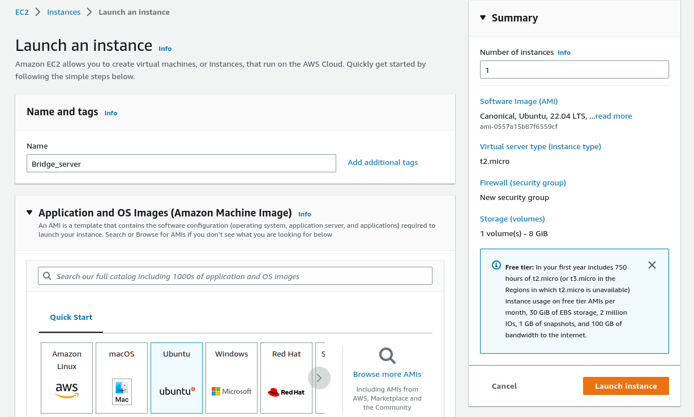
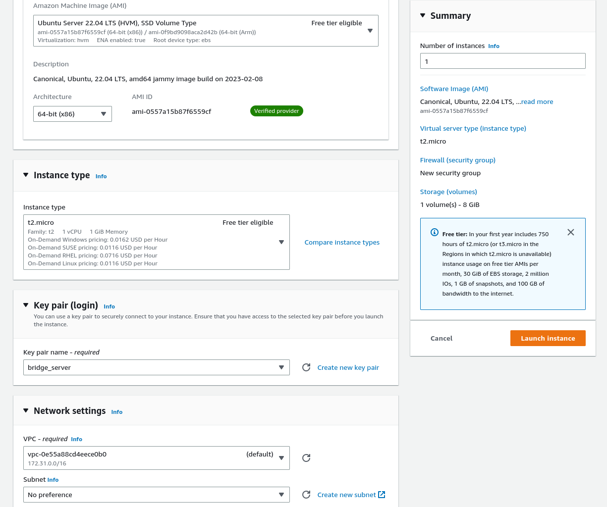
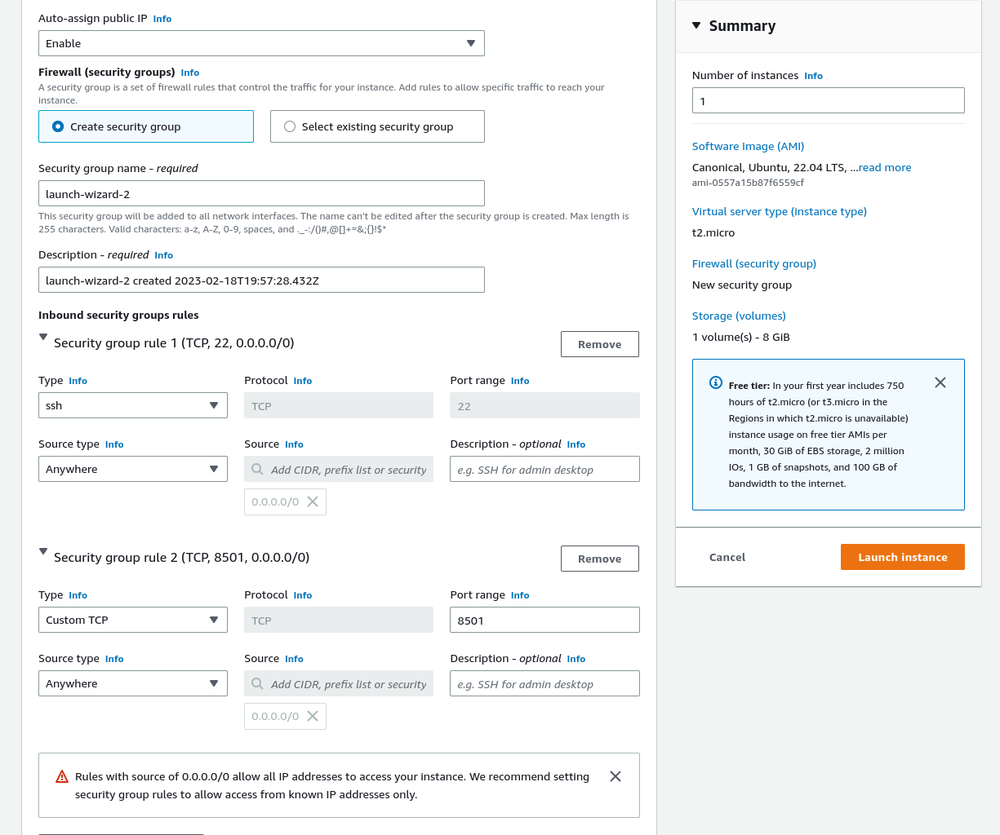

# bridge_server

This personal project consists on a Asynchronous Server that acts as a bridge and allows the connected clients to communicate between them with messages.
The scope of this project is to test cloud integration, in AWS, with a simple server running. So the server will be hosted in aws and the clients will connect to it using the assigned **IP** and **PORT**.

**Attention:** This code was generated and ran using linux (Ubuntu 22.04), but it should work accross various Operating System.

# Setup

This project has some dependencies that need to be met. For installation, feel free to use a [Python Venv](https://docs.python.org/3/library/venv.html) and execute the following command:

```bash
pip install -r requirements.txt
```

# Github actions

To implement a Agile methodology and some steps of CI/CD, I decided to implement to Github Actions to improve our workflow. One is for running tests and building the code and the other is for auto-generating documentation. They can be found in the projects `Actions` tab.

## Tests

To guarantee good development and functioning of the system, I decided to implement tests using the [pytest framework](https://docs.pytest.org/en/7.2.x/). This tests can be found at the `tests` directory and can be executed by simply running:

```bash
pytest
```

## Documentation

Documentation is a special part of any project, so in every package, class and methods created, I made sure to write good comments and information that can be easily updated, auto-generated and compiled into one easily readable file. For that, I chose the [pdoc3](https://pypi.org/project/pdoc3/) auto documentation tool. With this tool I just needed to write comments in the [google styleguide](https://google.github.io/styleguide/pyguide.html#38-comments-and-docstrings) and those comments arew« then compiled into html files. Once a commit is executed the github action will auto generate the documentation and upload it to the `docs/assignment-2---bingo-19` folder, where it can be executed via a browser.

* If you wish to manually execute the auto-documentation, execute the following command:
  ```bash
  pdoc3 --html --force -o ./docs .
  ```
* To open the documentation, go to the folder and execute it with your browser of choice, for example
  ```bash
  brave-browser index.html
  ```

# Get-Started

This project can be both executed locally or using [AWS](https://aws.amazon.com/) for cloud hosting. You can follow the two sub-headings bellow for each method.

## Locally

To execute the project locally navigate to the `./server` folder and execute the command:

```bash
python3 server.py --bind <ip_to_bind> --port <port_to_bind>
```

Then navigate to the `./client` folder and execute the following command for every client to be launched

```bash
python3 client.py --bind <ip_to_bind> --port <port_to_bind> --nick <client_name>
```

## AWS

### AWS configuration

Head over to [AWS](https://aws.amazon.com/) and sign-in/up, after that choose the best region in the top right corner. Then head over to the EC2 instances area and create/launch a new instance.
In the following window, assignet it a name and choose a OS.



In the following image is the next configuration. Don't forget to create a Key pair login for ssh use and save the public key, since you won't be able to see it again.



In the next image, select the edit button in the **Network Settings** tab and fill the information tailored to your preferred server *PORT*



The next configurations should be default and launch the instance. 

Wait for it to load and follow the guides to connect to it.  u

Next step is to update the machine, clone this repository and follow the next sub-section

### Executing the project

In the EC2 instance execute navigate to the `./server` folder and execute the command:

```bash
python3 server.py --bind 0.0.0.0 --port <port_to_bind>
```

**Note:** Using the Ip Address `0.0.0.0` is not recommended, because it binds the server to all available addresses. So please use it just for experimentation.

Navigate to your personal `./client` folder and execute the following command for every client to be launched

```bash
python3 client.py --bind <ip_to_bind> --port <port_to_bind> --nick <client_name>
```

## Note

For each python file, there are a set of arguments that can/should be provided when launching, please execute the file with `-h` argument to see which.

**Attention:** When launching the clients don't forget to specify it's nick or name

# Logs

As you can see, if you execute the project at least once, both in the client and server, a `logs` folder will appear. In this folder, you can check the logs by yourself, to view the exchanged information betweem the client and server, as well as their responses and decisions.

If you execute the programs a lot of times, a sizable ammount of log files may be created. To assist in that, I created a simple bash script that automatically removes all the log files. You can execute using the following command:

```bash
bash clear_logs.sh
```
